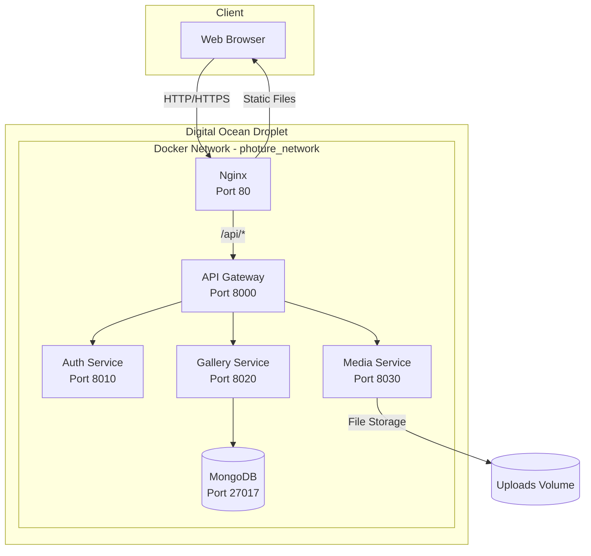
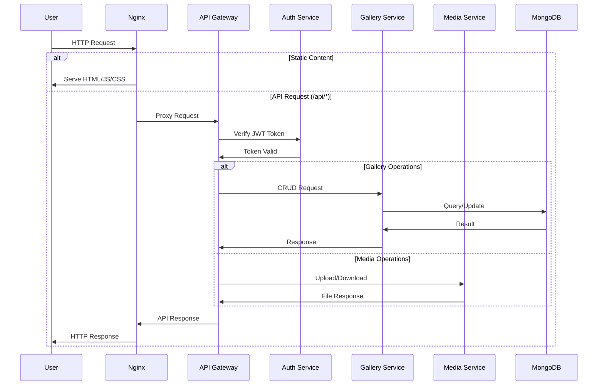
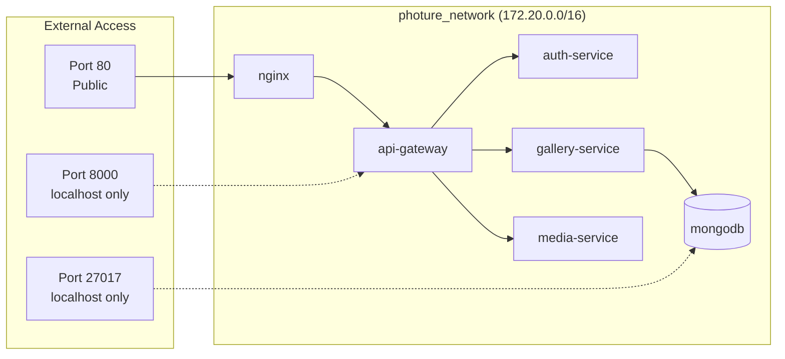
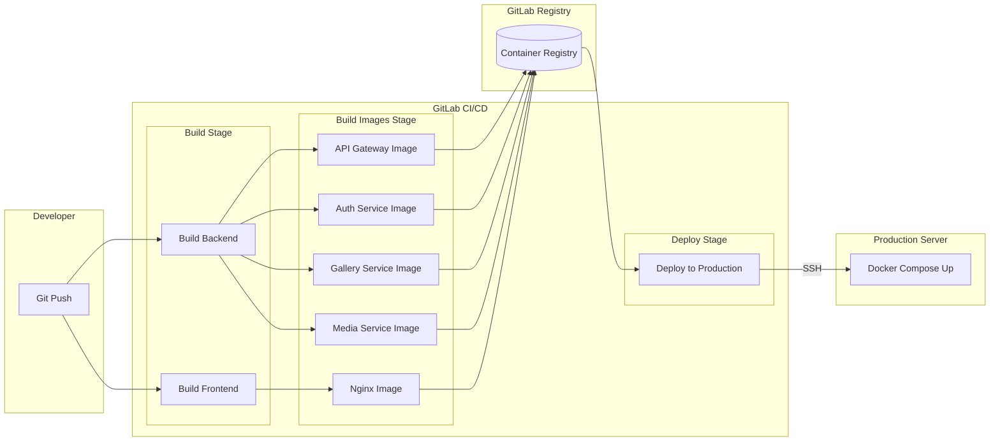

# DEPLOYING PHOTURE - A MICROSERVICES PHOTO MANAGEMENT PLATFORM TO DIGITAL OCEAN USING DOCKER-COMPOSE, NGINX, AND GITLAB CI/CD

---

## INTRODUCTION

### 1.1. Application Overview

**Photure** is a modern, cloud-ready photo management platform designed for secure storage and scalable organization of photos. In an era where digital photography has become ubiquitous, the need for efficient, secure, and scalable photo management solutions has grown significantly. Photure addresses this need by providing a comprehensive platform that allows users to upload, organize, and manage their photo collections with ease.

Built on a **microservices architecture**, the system separates concerns into independent, loosely-coupled services that can be developed, deployed, and scaled independently. This architectural approach provides several advantages including improved fault isolation, technology flexibility, and easier maintenance. The system comprises:

- **Frontend (React + TypeScript + Vite):** A responsive single-page application providing an intuitive user interface with dark/light theme support, drag-and-drop upload functionality, and real-time gallery management. The use of TypeScript ensures type safety and improved developer experience.
- **API Gateway (FastAPI):** The single entry point for all client requests, responsible for JWT authentication verification, request routing to appropriate backend services, and response aggregation. This pattern simplifies client communication and centralizes cross-cutting concerns.
- **Auth Service:** Manages user authentication through Clerk, a modern authentication platform. This service handles JWT token verification and ensures that only authenticated users can access protected resources.
- **Gallery Service:** Handles photo metadata CRUD operations (Create, Read, Update, Delete) with MongoDB as the persistence layer. This service manages photo titles, descriptions, tags, and organizational structure.
- **Media Service:** Manages binary file operations including upload, retrieval, and deletion of actual photo files. Files are stored on server volumes with proper organization and access control.
- **MongoDB:** A NoSQL document database chosen for its flexibility in handling varied photo metadata structures and its excellent performance for read-heavy workloads typical in gallery applications.
- **Nginx:** High-performance reverse proxy serving static frontend files and routing API requests to the backend gateway. Nginx also handles compression, caching headers, and security configurations.

### 1.2. Project Motivation

The software industry has witnessed a significant shift towards microservices architecture, containerization, and continuous integration/continuous deployment (CI/CD) practices. These modern approaches offer numerous benefits:

- **Microservices** enable teams to develop, deploy, and scale individual components independently, reducing the risk of system-wide failures and allowing for more agile development cycles.
- **Containerization with Docker** provides consistent environments across development, testing, and production, eliminating the "it works on my machine" problem and simplifying deployment processes.
- **CI/CD pipelines** automate the build, test, and deployment processes, reducing human error, accelerating release cycles, and enabling rapid iteration based on user feedback.

Deploying to cloud infrastructure, specifically Digital Ocean, offers flexible scaling capabilities, simplified server management through their intuitive interface, and cost-effective hosting options ideal for personal projects and small to medium-sized applications. Digital Ocean Droplets provide a balance between performance, control, and affordability that makes them an excellent choice for learning and implementing DevOps practices.

This project serves as a practical application of Linux system administration, Docker containerization, and DevOps principles, bridging the gap between theoretical knowledge and real-world implementation.

### 1.3. Project Objectives

The primary objectives of this project are:

- **Containerization:** Build and deploy the Photure microservices system using Docker & Docker Compose, ensuring each service runs in an isolated, reproducible environment
- **CI/CD Automation:** Establish an automated CI/CD pipeline with GitLab that handles building Docker images, pushing to container registry, and deploying to production with minimal manual intervention
- **Reverse Proxy Configuration:** Configure Nginx as a reverse proxy for serving the frontend static files and routing API requests to the backend gateway, implementing proper security headers and compression
- **Infrastructure Automation:** Develop a comprehensive server provisioning script (setup-droplet.sh) that automates the initial server setup, reducing deployment time and ensuring consistency
- **Production Deployment:** Deploy the complete system to a Digital Ocean Droplet with proper security configurations, monitoring considerations, and production-ready settings

### 1.4. Project Scope

This project encompasses the following components and configurations:

- **6 Containerized Services:** api-gateway, auth-service, gallery-service, media-service, frontend (nginx), and mongodb, all orchestrated through Docker Compose
- **GitLab CI/CD Pipeline:** A multi-stage pipeline with build, build-images, and deploy stages, utilizing GitLab Container Registry for image storage
- **Nginx Reverse Proxy:** Configuration for static file serving, API proxying, gzip compression, and security hardening
- **Digital Ocean Droplet:** Ubuntu-based cloud server serving as the production environment
- **Security Implementation:** UFW firewall configuration, SSH key-based authentication, dedicated deployment user with limited privileges, and localhost-only binding for internal services

### 1.5. Report Structure

This report is organized into three main chapters following the introduction:

- **Chapter 1 (Overview):** Provides a comprehensive overview of all technologies, programming languages, frameworks, and tools used in the project, explaining the rationale behind each technology choice.
- **Chapter 2 (Infrastructure Design & Implementation):** Details the infrastructure architecture through diagrams, explains the server provisioning process, and provides in-depth analysis of all configuration files including Dockerfiles, Docker Compose, GitLab CI/CD, and Nginx configurations.
- **Chapter 3 (Results):** Presents the deployment outcomes, demonstrates the working CI/CD pipeline, discusses security verification results, and shares lessons learned along with challenges encountered during implementation.

The report concludes with a summary of achievements, reflection on the learning experience, and suggestions for future improvements.

---

## Chapter 1: OVERVIEW

### 1.1. Programming Languages

| Language | Version | Purpose |
|----------|---------|---------|
| TypeScript | 5.8.3 | Frontend development with type safety |
| Python | 3.11 | Backend microservices |
| Bash | - | Server setup automation scripts |

### 1.2. Frameworks & Libraries

**Frontend Stack:**

| Technology | Version | Description |
|------------|---------|-------------|
| React | 19.1.0 | UI Framework for SPA development |
| Vite | 7.0.0 | Build tool and development server |
| TailwindCSS | 4.1.11 | Utility-first CSS framework |
| Radix UI | - | Accessible component library |
| Clerk (React) | - | Authentication & user management |

**Backend Stack:**

| Technology | Version | Description |
|------------|---------|-------------|
| FastAPI | 0.110.0 | Async Python API framework |
| Motor | 3.6.0 | Async MongoDB driver |
| Pydantic | 2.11.2 | Data validation |
| Uvicorn | - | ASGI server |
| Clerk (Backend) | - | JWT verification |

### 1.3. Other Technologies

| Technology | Version/Type | Purpose |
|------------|--------------|---------|
| Digital Ocean Droplet | Cloud VPS | Production hosting |
| Docker | 24.0.5 | Container runtime |
| Docker Compose | Latest | Container orchestration |
| Nginx | Alpine | Reverse proxy, static serving |
| GitLab CI/CD | - | Automated pipeline |
| MongoDB | 7.0 | NoSQL database |
| UFW | - | Firewall management |

---

## Chapter 2: INFRASTRUCTURE DESIGN & IMPLEMENTATION

### 2.1. Infrastructure Design Analysis

#### 2.1.1. System Architecture Diagram



#### 2.1.2. Service Communication Flow



#### 2.1.3. Docker Network Topology



#### 2.1.4. CI/CD Pipeline Flow



### 2.2. Server Setup & Provisioning (setup-droplet.sh)

The `setup-droplet.sh` script automates the complete server preparation process for deploying Photure on a fresh Digital Ocean Droplet.

#### 2.2.1. Docker & Docker Compose Installation

```bash
# Install Docker
curl -fsSL https://download.docker.com/linux/ubuntu/gpg | gpg --dearmor -o /usr/share/keyrings/docker-archive-keyring.gpg
echo "deb [arch=$(dpkg --print-architecture) signed-by=/usr/share/keyrings/docker-archive-keyring.gpg] https://download.docker.com/linux/ubuntu $(lsb_release -cs) stable" | tee /etc/apt/sources.list.d/docker.list > /dev/null
apt-get update
apt-get install -y docker-ce docker-ce-cli containerd.io docker-buildx-plugin docker-compose-plugin

# Install Docker Compose standalone
curl -L "https://github.com/docker/compose/releases/latest/download/docker-compose-$(uname -s)-$(uname -m)" -o /usr/local/bin/docker-compose
chmod +x /usr/local/bin/docker-compose
```

**Components installed:**
- `docker-ce`: Docker Community Edition engine
- `docker-ce-cli`: Docker command-line interface
- `containerd.io`: Container runtime
- `docker-buildx-plugin`: Extended build capabilities
- `docker-compose-plugin`: Compose as Docker plugin
- Docker Compose standalone binary for compatibility

#### 2.2.2. Deploy User Creation & Configuration

```bash
# Create deploy user
useradd -m -s /bin/bash deploy
usermod -aG docker deploy
usermod -aG sudo deploy

# Configure sudoers for passwordless docker commands
echo "deploy ALL=(ALL) NOPASSWD: /usr/bin/docker, /usr/bin/docker-compose, /usr/local/bin/docker-compose" > /etc/sudoers.d/deploy
chmod 440 /etc/sudoers.d/deploy
```

**Security rationale:**
- Dedicated `deploy` user prevents running containers as root
- Docker group membership allows container management without sudo
- Limited sudoers entry restricts passwordless execution to Docker commands only

#### 2.2.3. SSH Configuration for Deploy User

```bash
mkdir -p /home/deploy/.ssh
chmod 700 /home/deploy/.ssh

# Copy root's authorized_keys to deploy user
if [ -f /root/.ssh/authorized_keys ]; then
    cp /root/.ssh/authorized_keys /home/deploy/.ssh/authorized_keys
    chmod 600 /home/deploy/.ssh/authorized_keys
fi

chown -R deploy:deploy /home/deploy/.ssh
```

**Permission structure:**
- `.ssh` directory: 700 (owner read/write/execute only)
- `authorized_keys`: 600 (owner read/write only)
- Enables same SSH key access for both root and deploy users

#### 2.2.4. Application Directory Structure

```bash
mkdir -p /opt/photure
mkdir -p /opt/photure/data/mongodb
mkdir -p /opt/photure/data/uploads
mkdir -p /opt/photure/logs
chown -R deploy:deploy /opt/photure
```

**Directory purposes:**

| Path | Purpose |
|------|---------|
| `/opt/photure` | Application root directory |
| `/opt/photure/data/mongodb` | MongoDB data persistence volume |
| `/opt/photure/data/uploads` | Uploaded photos storage |
| `/opt/photure/logs` | Nginx and application logs |

#### 2.2.5. Firewall Configuration (UFW)

```bash
ufw default deny incoming
ufw default allow outgoing
ufw allow ssh
ufw allow http
ufw allow https
ufw --force enable
```

**Firewall rules:**

| Rule | Port | Purpose |
|------|------|---------|
| deny incoming | all | Block all incoming by default |
| allow outgoing | all | Permit all outgoing connections |
| allow ssh | 22 | Remote server access |
| allow http | 80 | Web traffic |
| allow https | 443 | Secure web traffic |

#### 2.2.6. System Nginx Disable

```bash
systemctl stop nginx 2>/dev/null || true
systemctl disable nginx 2>/dev/null || true
```

Disables any pre-installed system Nginx to free ports 80/443 for the Docker container.

### 2.3. Design Implementation

#### 2.3.1. Dockerfiles

All backend services follow a consistent Dockerfile pattern:

**API Gateway Dockerfile:**
```dockerfile
FROM python:3.11-slim AS runtime

ENV PYTHONDONTWRITEBYTECODE=1
ENV PYTHONUNBUFFERED=1
ENV PYTHONPATH=/app

WORKDIR /app

COPY services/common /app/services/common
COPY services/api_gateway /app/services/api_gateway

RUN pip install --no-cache-dir -r services/api_gateway/requirements.txt

EXPOSE 8000

CMD ["uvicorn", "services.api_gateway.app.main:app", "--host", "0.0.0.0", "--port", "8000"]
```

**Service Port Mapping:**

| Service | Internal Port | Description |
|---------|---------------|-------------|
| api-gateway | 8000 | Main API entry point |
| auth-service | 8010 | Authentication service |
| gallery-service | 8020 | Photo metadata management |
| media-service | 8030 | File upload/download |

**Nginx Dockerfile (Multi-stage build):**
```dockerfile
# Stage 1: Build frontend
FROM node:18-alpine AS frontend-build
WORKDIR /app

# Define build arguments for Vite environment variables
ARG VITE_APP_URL
ARG VITE_CLERK_PUBLISHABLE_KEY

# Set environment variables for the build process
ENV VITE_APP_URL=$VITE_APP_URL
ENV VITE_CLERK_PUBLISHABLE_KEY=$VITE_CLERK_PUBLISHABLE_KEY

# Copy package files first for better layer caching
COPY photure-fe/package.json photure-fe/package-lock.json ./

# Install dependencies with clean install
RUN npm ci

# Copy source code
COPY photure-fe/ .

# Build the production bundle
RUN npm run build

# Stage 2: Nginx production server
FROM nginx:alpine

# Copy built static files from build stage
COPY --from=frontend-build /app/dist /usr/share/nginx/html

# Copy custom nginx configuration
COPY nginx/nginx.conf /etc/nginx/nginx.conf

# Expose HTTP and HTTPS ports
EXPOSE 80 443

# Start nginx in foreground mode
CMD ["nginx", "-g", "daemon off;"]
```

**Dockerfile Analysis:**

| Stage | Base Image | Purpose |
|-------|------------|---------|
| frontend-build | node:18-alpine | Compile React/TypeScript to static files |
| production | nginx:alpine | Serve static files with reverse proxy |

**Stage 1 - Frontend Build:**
- `ARG` directives define build-time variables passed from CI/CD pipeline
- `ENV` converts ARGs to environment variables accessible during `npm run build`
- Vite reads `VITE_*` prefixed variables and embeds them into the JavaScript bundle
- `npm ci` ensures reproducible builds using exact versions from package-lock.json
- Build output (`/app/dist`) contains optimized HTML, CSS, and JavaScript files

**Stage 2 - Nginx Production:**
- `nginx:alpine` provides minimal footprint (~23MB base image)
- `COPY --from=frontend-build` transfers only the built artifacts, discarding Node.js and dependencies
- Custom `nginx.conf` configures reverse proxy and SPA routing
- `daemon off` keeps Nginx in foreground for Docker container lifecycle management

**Multi-stage build benefits:**
- **Smaller final image:** ~25MB vs ~500MB+ if Node.js included
- **Security:** No build tools, source code, or node_modules in production
- **Faster deployment:** Smaller images transfer quickly to production server
- **Build-time secrets:** Environment variables embedded at build, not runtime

#### 2.3.2. Docker Compose Configuration

**docker-compose.prod.yml analysis:**

```yaml
services:
  mongodb:
    image: mongo:7.0
    container_name: photure_mongodb
    restart: unless-stopped
    environment:
      MONGO_INITDB_ROOT_USERNAME: ${MONGO_ROOT_USERNAME}
      MONGO_INITDB_ROOT_PASSWORD: ${MONGO_ROOT_PASSWORD}
      MONGO_INITDB_DATABASE: ${MONGO_DATABASE}
    ports:
      - "127.0.0.1:27017:27017"  # Localhost only
    volumes:
      - /opt/photure/data/mongodb:/data/db
    networks:
      - photure_network
```

**Key configuration aspects:**

| Aspect | Configuration | Purpose |
|--------|---------------|---------|
| Network | photure_network (172.20.0.0/16) | Isolated container communication |
| Port binding | 127.0.0.1:port:port | Security - internal services not exposed |
| Volumes | Host paths mounted | Data persistence across restarts |
| Restart policy | unless-stopped | Auto-recovery on failure |
| Environment | Variables from .env | Secrets management |

#### 2.3.3. GitLab CI/CD Configuration

**.gitlab-ci.yml structure:**

```yaml
stages:
  - build
  - build-images
  - deploy
```

**Stage 1: Build**
- `build:frontend`: Compiles React application with Vite
- `build:backend`: Validates Python dependencies

**Stage 2: Build Images**
- Parallel jobs for each service image
- Uses Docker-in-Docker (dind) service
- Pushes to GitLab Container Registry

```yaml
build:api-gateway-image:
  <<: *docker-template
  stage: build-images
  script:
    - docker build -f services/api_gateway/Dockerfile -t $CI_REGISTRY_IMAGE/api-gateway:latest .
    - docker push $CI_REGISTRY_IMAGE/api-gateway:latest
  only:
    - main
```

**Stage 3: Deploy**
- Manual trigger for production safety
- SSH connection to production server
- Pulls latest images and restarts containers

```yaml
deploy:production:
  stage: deploy
  script:
    - |
      ssh -i ~/.ssh/id_rsa $DEPLOY_USER@$PRODUCTION_HOST << 'ENDSSH'
        cd /opt/photure
        docker-compose -f docker-compose.prod.yml down
        git pull origin main
        docker pull $CI_REGISTRY_IMAGE/api-gateway:latest
        # ... pull other images
        docker-compose -f docker-compose.prod.yml up -d
        sleep 30
        curl -f http://localhost || exit 1
        docker image prune -f
      ENDSSH
  only:
    - main
  when: manual
```

**CI/CD Variables Required:**

| Variable | Purpose |
|----------|---------|
| CI_REGISTRY_USER | GitLab registry username |
| CI_REGISTRY_PASSWORD | GitLab registry password |
| SSH_PRIVATE_KEY | Server SSH key (file) |
| PRODUCTION_HOST | Server IP/hostname |
| DEPLOY_USER | SSH user (deploy) |
| VITE_APP_URL | Frontend URL |
| VITE_CLERK_PUBLISHABLE_KEY | Clerk public key |

#### 2.3.4. Nginx Configuration

```nginx
events {
    worker_connections 1024;
}

http {
    include       /etc/nginx/mime.types;
    default_type  application/octet-stream;
    server_tokens off;  # Hide version for security

    # Gzip compression
    gzip on;
    gzip_types text/plain text/css text/javascript 
               application/javascript application/json;

    upstream api_gateway {
        server api-gateway:8000;
    }

    server {
        listen 80;
        server_name localhost;

        # API routes - proxy to backend
        location /api/ {
            proxy_pass http://api_gateway;
            proxy_set_header Host $host;
            proxy_set_header X-Real-IP $remote_addr;
            proxy_set_header X-Forwarded-For $proxy_add_x_forwarded_for;
            proxy_set_header X-Forwarded-Proto $scheme;
            client_max_body_size 100M;  # Allow large uploads
        }

        # Frontend - serve static files
        location / {
            root /usr/share/nginx/html;
            try_files $uri $uri/ /index.html;  # SPA routing
        }

        # Security: deny hidden files
        location ~ /\. {
            deny all;
        }
    }
}
```

**Configuration highlights:**

| Feature | Configuration | Purpose |
|---------|---------------|---------|
| Upstream | api-gateway:8000 | Load balancing ready |
| Gzip | Enabled for text types | Bandwidth optimization |
| SPA routing | try_files with /index.html | Client-side routing support |
| Upload limit | client_max_body_size 100M | Large photo uploads |
| Security | server_tokens off | Hide Nginx version |

---

## Chapter 3: RESULT

### 3.1. Deployed System

After successful deployment, the Photure system runs as 6 Docker containers on the Digital Ocean Droplet:

**Expected `docker ps` output:**
```
CONTAINER ID   IMAGE                                    STATUS          PORTS                      NAMES
xxxx           registry.gitlab.com/.../nginx:latest    Up X hours      0.0.0.0:80->80/tcp         photure_nginx
xxxx           registry.gitlab.com/.../api-gateway     Up X hours      127.0.0.1:8000->8000/tcp   photure_api_gateway
xxxx           registry.gitlab.com/.../auth-service    Up X hours                                 photure_auth_service
xxxx           registry.gitlab.com/.../gallery-service Up X hours                                 photure_gallery_service
xxxx           registry.gitlab.com/.../media-service   Up X hours                                 photure_media_service
xxxx           mongo:7.0                               Up X hours      127.0.0.1:27017->27017/tcp photure_mongodb
```

**System accessibility:**
- Frontend accessible via public IP/domain on port 80
- API endpoints available at `/api/*`
- Internal services communicate via Docker network

### 3.2. CI/CD Pipeline Results

**Pipeline stages execution:**

| Stage | Jobs | Duration | Status |
|-------|------|----------|--------|
| build | build:frontend, build:backend | ~2-3 min | Automatic |
| build-images | 5 parallel image builds | ~5-7 min | Automatic |
| deploy | deploy:production | ~2-3 min | Manual trigger |

**Deployment workflow:**
1. Developer pushes to `main` branch
2. GitLab automatically runs build and build-images stages
3. Images pushed to GitLab Container Registry
4. Manual deploy trigger initiates production update
5. Server pulls new images and restarts containers
6. Health check validates deployment

### 3.3. Security Results

**UFW Status:**
```
Status: active

To                         Action      From
--                         ------      ----
22/tcp                     ALLOW       Anywhere
80/tcp                     ALLOW       Anywhere
443/tcp                    ALLOW       Anywhere
```

**Security verification:**
- MongoDB not accessible from external network
- SSH accepts only key-based authentication
- Internal service ports bound to localhost only
- Nginx hides version information

### 3.4. Lessons Learned & Challenges

**Challenges encountered:**

| Issue | Solution |
|-------|----------|
| Docker networking | Use custom bridge network with defined subnet |
| Environment variables | Separate .env files for dev/prod |
| CORS configuration | Configure in API Gateway, not Nginx |
| File permissions | Ensure deploy user owns application directories |
| Port conflicts | Disable system Nginx before Docker deployment |

**Optimization tips:**
- Use multi-stage Docker builds to reduce image size
- Implement Docker layer caching in CI/CD
- Add health checks to docker-compose for reliability
- Use `docker image prune` to clean unused images

---

## CONCLUSION

### Summary of Achievements

This project successfully accomplished the deployment of the Photure microservices photo management platform to Digital Ocean infrastructure using Docker Compose for container orchestration, Nginx as a reverse proxy, and GitLab CI/CD for automated deployment pipelines. The implementation serves as a comprehensive demonstration of modern DevOps practices and Linux system administration skills applied to a real-world application.

Throughout this project, several key objectives were achieved:

- **Microservices Deployment:** Successfully containerized and deployed 6 interconnected services (API Gateway, Auth Service, Gallery Service, Media Service, MongoDB, and Nginx) with proper network isolation using Docker's bridge networking. Each service operates independently while communicating seamlessly through the defined network topology.

- **CI/CD Pipeline Implementation:** Established a fully automated GitLab CI/CD pipeline that reduces deployment time from potentially hours of manual work to just minutes of automated execution. The pipeline handles frontend compilation, backend validation, Docker image building, registry pushing, and production deployment with a single git push to the main branch.

- **Infrastructure Automation:** Developed a comprehensive server provisioning script (setup-droplet.sh) that automates the entire server setup process, including Docker installation, user creation, directory structure setup, and firewall configuration. This script ensures reproducibility and significantly reduces the time required to provision new servers.

- **Security Implementation:** Implemented multiple layers of security including UFW firewall with minimal open ports, SSH key-based authentication, dedicated deployment user with limited privileges, and localhost-only binding for internal services to prevent unauthorized external access.

### Lessons Learned

This project provided valuable hands-on experience with several important concepts:

- **Container Networking:** Understanding how Docker networks facilitate inter-container communication while maintaining isolation from external access proved essential for proper service architecture.
- **CI/CD Best Practices:** Learning to structure pipelines with proper stages, caching strategies, and manual deployment gates for production safety.
- **Linux System Administration:** Practical experience with user management, file permissions, firewall configuration, and service management on Ubuntu servers.
- **Infrastructure as Code:** The importance of scripting and documenting infrastructure setup for reproducibility and disaster recovery.

### Future Improvements

While the current implementation provides a solid foundation, several enhancements could further improve the system:

- **SSL/HTTPS Implementation:** Integrate Let's Encrypt with Certbot for automated SSL certificate provisioning and renewal, ensuring encrypted communication between clients and the server.
- **Horizontal Scaling:** Migrate from Docker Compose to Docker Swarm or Kubernetes for horizontal scaling capabilities, load balancing, and improved high availability.
- **Monitoring and Observability:** Implement comprehensive monitoring using Prometheus for metrics collection and Grafana for visualization, enabling proactive issue detection and performance optimization.
- **Content Delivery Network:** Configure a CDN (such as Cloudflare or AWS CloudFront) for static assets and images to reduce latency for geographically distributed users and decrease server load.
- **Automated Backups:** Implement scheduled MongoDB backups with off-site storage to ensure data durability and enable point-in-time recovery in case of data loss.
- **Log Aggregation:** Set up centralized logging using the ELK stack (Elasticsearch, Logstash, Kibana) or similar solutions for easier debugging and audit trails.

### Final Remarks

This project demonstrates that deploying a microservices application to cloud infrastructure is achievable with careful planning and the right combination of tools. The skills and knowledge gained through this implementation—including Docker containerization, CI/CD pipeline design, Nginx configuration, and Linux server administration—are directly applicable to professional software development and DevOps roles. The Photure platform now serves as both a functional photo management application and a reference implementation for future microservices projects.

---

## REFERENCE DOCUMENTS

1. Docker Documentation - https://docs.docker.com/
2. Docker Compose Documentation - https://docs.docker.com/compose/
3. Nginx Documentation - https://nginx.org/en/docs/
4. GitLab CI/CD Documentation - https://docs.gitlab.com/ee/ci/
5. Digital Ocean Droplet Documentation - https://docs.digitalocean.com/products/droplets/
6. FastAPI Documentation - https://fastapi.tiangolo.com/
7. MongoDB Documentation - https://www.mongodb.com/docs/
8. Clerk Authentication - https://clerk.com/docs
9. UFW Firewall Guide - https://help.ubuntu.com/community/UFW

---

## APPENDICES

### A.1. Server Setup Script
Source: [setup-droplet.sh](../scripts/setup-droplet.sh)

### A.2. Docker Compose Files
- Development: [docker-compose.dev.yml](../docker-compose.dev.yml)
- Production: [docker-compose.prod.yml](../docker-compose.prod.yml)

### A.3. Nginx Configuration
Source: [nginx/nginx.conf](../nginx/nginx.conf)

### A.4. GitLab CI/CD Configuration
Source: [.gitlab-ci.yml](../.gitlab-ci.yml)

### A.5. Repository
GitLab Repository: [Link to repository]
