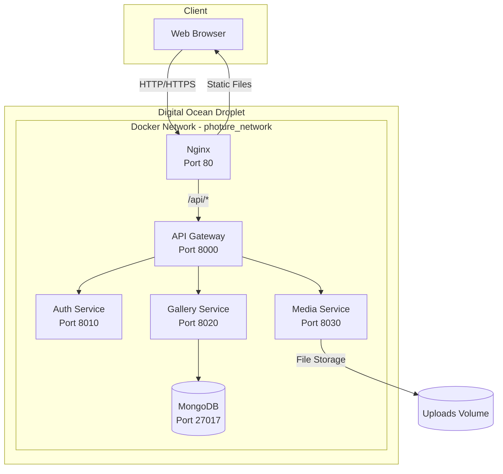
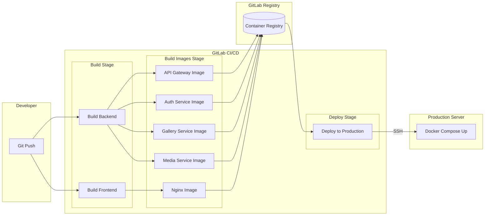

# DEPLOYING PHOTURE
## A Microservices Photo Management Platform to Digital Ocean
### Using Docker-Compose, Nginx, and GitLab CI/CD

---

# Project Introduction

**Photure** - Modern cloud-ready photo management platform

**Architecture:** Microservices with 6 containerized services

| Service | Technology | Port |
|---------|------------|------|
| Frontend | React + TypeScript + Vite | 80 (via Nginx) |
| API Gateway | FastAPI | 8000 |
| Auth Service | FastAPI + Clerk | 8010 |
| Gallery Service | FastAPI + MongoDB | 8020 |
| Media Service | FastAPI | 8030 |
| Database | MongoDB 7.0 | 27017 |

---

# Project Objectives

- **Containerization:** Docker & Docker Compose for all services
- **CI/CD Automation:** GitLab pipeline (build → push → deploy)
- **Reverse Proxy:** Nginx for static files & API routing
- **Infrastructure Automation:** setup-droplet.sh script
- **Production Deployment:** Digital Ocean Droplet

---

# System Architecture Diagram



---

# CI/CD Pipeline Flow



---

# Deploy User Configuration

```bash
# Create deploy user
useradd -m -s /bin/bash deploy
usermod -aG docker deploy
usermod -aG sudo deploy

# Configure sudoers for passwordless docker commands
echo "deploy ALL=(ALL) NOPASSWD: /usr/bin/docker, /usr/bin/docker-compose, /usr/local/bin/docker-compose" > /etc/sudoers.d/deploy
chmod 440 /etc/sudoers.d/deploy
```

**Security rationale:**
- Dedicated `deploy` user prevents running containers as root
- Docker group membership allows container management without sudo
- Limited sudoers entry restricts passwordless execution to Docker commands only

---

# SSH Configuration

```bash
mkdir -p /home/deploy/.ssh
chmod 700 /home/deploy/.ssh

# Copy root's authorized_keys to deploy user
if [ -f /root/.ssh/authorized_keys ]; then
    cp /root/.ssh/authorized_keys /home/deploy/.ssh/authorized_keys
    chmod 600 /home/deploy/.ssh/authorized_keys
fi

chown -R deploy:deploy /home/deploy/.ssh
```

**Permission structure:**
- `.ssh` directory: 700 (owner read/write/execute only)
- `authorized_keys`: 600 (owner read/write only)
- Enables same SSH key access for both root and deploy users

---

# Firewall Configuration (UFW)

```bash
ufw default deny incoming
ufw default allow outgoing
ufw allow ssh
ufw allow http
ufw allow https
ufw --force enable
```

**Firewall rules:**

| Rule | Port | Purpose |
|------|------|---------|
| deny incoming | all | Block all incoming by default |
| allow outgoing | all | Permit all outgoing connections |
| allow ssh | 22 | Remote server access |
| allow http | 80 | Web traffic |
| allow https | 443 | Secure web traffic |

---

# API Gateway Dockerfile

```dockerfile
FROM python:3.11-slim AS runtime

ENV PYTHONDONTWRITEBYTECODE=1
ENV PYTHONUNBUFFERED=1
ENV PYTHONPATH=/app

WORKDIR /app

COPY services/common /app/services/common
COPY services/api_gateway /app/services/api_gateway

RUN pip install --no-cache-dir -r services/api_gateway/requirements.txt

EXPOSE 8000

CMD ["uvicorn", "services.api_gateway.app.main:app", "--host", "0.0.0.0", "--port", "8000"]
```

**Key points:**
- `python:3.11-slim` - Minimal Python image
- `PYTHONDONTWRITEBYTECODE=1` - No .pyc files
- `PYTHONUNBUFFERED=1` - Real-time logging
- Uvicorn ASGI server on port 8000

---

# Nginx Dockerfile (Multi-stage)

```dockerfile
# Stage 1: Build frontend
FROM node:18-alpine AS frontend-build
WORKDIR /app

ARG VITE_APP_URL
ARG VITE_CLERK_PUBLISHABLE_KEY
ENV VITE_APP_URL=$VITE_APP_URL
ENV VITE_CLERK_PUBLISHABLE_KEY=$VITE_CLERK_PUBLISHABLE_KEY

COPY photure-fe/package.json photure-fe/package-lock.json ./
RUN npm ci
COPY photure-fe/ .
RUN npm run build

# Stage 2: Nginx production server
FROM nginx:alpine
COPY --from=frontend-build /app/dist /usr/share/nginx/html
COPY nginx/nginx.conf /etc/nginx/nginx.conf
EXPOSE 80 443
CMD ["nginx", "-g", "daemon off;"]
```

---

# Nginx Dockerfile - Explanation

| Stage | Base Image | Purpose |
|-------|------------|---------|
| frontend-build | node:18-alpine | Compile React/TypeScript to static files |
| production | nginx:alpine | Serve static files with reverse proxy |

**Stage 1 - Frontend Build:**
- `ARG` + `ENV` pass build-time variables from CI/CD
- Vite embeds `VITE_*` variables into JavaScript bundle
- `npm ci` ensures reproducible builds

**Stage 2 - Nginx Production:**
- `nginx:alpine` ~23MB minimal footprint
- `COPY --from=frontend-build` transfers only built artifacts
- `daemon off` keeps Nginx in foreground for Docker

**Benefits:** ~25MB final image vs ~500MB+ with Node.js

---

# GitLab CI/CD Configuration

**.gitlab-ci.yml structure:**

```yaml
stages:
  - build
  - build-images
  - deploy
```

**Stage 1: Build**
- `build:frontend`: Compiles React application with Vite
- `build:backend`: Validates Python dependencies

**Stage 2: Build Images**
- Parallel jobs for each service image
- Uses Docker-in-Docker (dind) service
- Pushes to GitLab Container Registry

---

# GitLab CI/CD - Build Images

```yaml
build:api-gateway-image:
  <<: *docker-template
  stage: build-images
  script:
    - docker build -f services/api_gateway/Dockerfile -t $CI_REGISTRY_IMAGE/api-gateway:latest .
    - docker push $CI_REGISTRY_IMAGE/api-gateway:latest
  only:
    - main
```

- Build Docker image from Dockerfile
- Tag with GitLab registry path
- Push to GitLab Container Registry
- Only runs on `main` branch

---

# GitLab CI/CD - Deploy Stage

```yaml
deploy:production:
  stage: deploy
  script:
    - |
      ssh -i ~/.ssh/id_rsa $DEPLOY_USER@$PRODUCTION_HOST << 'ENDSSH'
        cd /opt/photure
        docker-compose -f docker-compose.prod.yml down
        git pull origin main
        docker pull $CI_REGISTRY_IMAGE/api-gateway:latest
        # ... pull other images
        docker-compose -f docker-compose.prod.yml up -d
        sleep 30
        curl -f http://localhost || exit 1
        docker image prune -f
      ENDSSH
  only:
    - main
  when: manual
```

- Manual trigger for production safety
- SSH to server, pull images, restart containers
- Health check validates deployment

---

# GitLab CI/CD Variables

| Variable | Purpose |
|----------|---------|
| CI_REGISTRY_USER | GitLab registry username |
| CI_REGISTRY_PASSWORD | GitLab registry password |
| SSH_PRIVATE_KEY | Server SSH key (file) |
| PRODUCTION_HOST | Server IP/hostname |
| DEPLOY_USER | SSH user (deploy) |
| VITE_APP_URL | Frontend URL |
| VITE_CLERK_PUBLISHABLE_KEY | Clerk public key |

---

# Nginx Configuration

```nginx
events {
    worker_connections 1024;
}

http {
    include       /etc/nginx/mime.types;
    default_type  application/octet-stream;
    server_tokens off;

    gzip on;
    gzip_types text/plain text/css text/javascript 
               application/javascript application/json;

    upstream api_gateway {
        server api-gateway:8000;
    }

    server {
        listen 80;
        server_name localhost;

        location /api/ {
            proxy_pass http://api_gateway;
            proxy_set_header Host $host;
            proxy_set_header X-Real-IP $remote_addr;
            proxy_set_header X-Forwarded-For $proxy_add_x_forwarded_for;
            proxy_set_header X-Forwarded-Proto $scheme;
            client_max_body_size 100M;
        }

        location / {
            root /usr/share/nginx/html;
            try_files $uri $uri/ /index.html;
        }

        location ~ /\. {
            deny all;
        }
    }
}
```

---

# Nginx Configuration - Explanation

The configuration starts with `events` block setting maximum concurrent connections to 1024 per worker process.

In the `http` block, `server_tokens off` hides Nginx version information from response headers for security purposes. Gzip compression is enabled for text-based content types (HTML, CSS, JavaScript, JSON) to reduce bandwidth usage and improve page load times.

The `upstream` directive defines the backend API Gateway server running on port 8000, using Docker's internal DNS resolution with the container name `api-gateway`.

Within the `server` block listening on port 80, two main location blocks handle routing:
- `/api/*` requests are proxied to the API Gateway with proper headers (`X-Real-IP`, `X-Forwarded-For`) to preserve client information. The `client_max_body_size 100M` allows large photo uploads.
- All other requests (`/`) serve static files from `/usr/share/nginx/html`. The `try_files` directive with fallback to `/index.html` enables client-side SPA routing.

Finally, `location ~ /\.` blocks access to hidden files (like `.env`, `.git`) for security.

---

# Thank You

**Repository:** [GitLab Link]

**Technologies Used:**
- Docker & Docker Compose
- GitLab CI/CD
- Nginx
- Digital Ocean
- FastAPI + React
